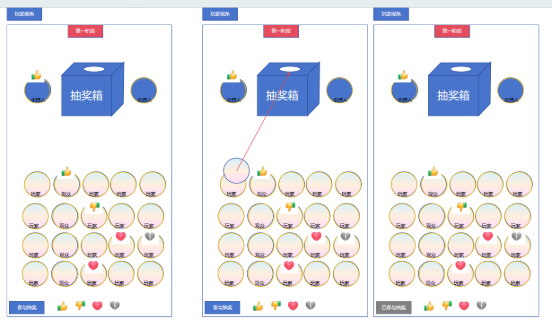

这是一个婚礼抽奖项目，请使用 Next.js，SUPABASE，完成这个移动端项目，支持部署到 Vercel，请拆解任务一步步完成，每一步之后我进行测试，没问题再进行下一步。

ui 美观一些。

**抽奖需求**

1. 抽取确定顺序流程阶段
1. 分玩家身份和主持人身份、观众身份，不同身份有不同的头像框
2. 观众身份
1. 所有人进入时均为观众身份，大家登录进来能看到自己的头像，所有人的头像在大厅里下半部分，按进房间顺序排序，退出房间不删除，重连回到当前位置

2. 所有观众界面上有成为主持人按钮，点击成为主持人，出输入密码弹窗，点击确认，密码正确弹窗关闭成为主持人身份，移动自身位置，密码错误弹窗关闭，弹出提示“密码错误”给输入密码的人

   

3. 主持人点击观众头像，出弹窗，可设置观众为玩家身份

   

4. 主持人点击玩家身份头像，出弹窗，可设置玩家为观众身份

   

5. 所有人头像排列在下方区域，人越多，头像越小，自适应大小，规则可再详聊
6. 点击抽奖箱打开一个小弹窗能看到当前抽奖箱里有哪些人，打开后侧边出现关闭按钮，再次点击则关闭抽奖箱弹窗

   

3. 玩家身份
1. 可以点击参与抽奖按钮，能把自己的头像复制一份扔到抽奖箱里，已经点过并在抽奖箱中的玩家按钮置灰

   

2. 点击抽奖箱打开一个小弹窗能看到当前抽奖箱里有哪些人，打开后侧边出现关闭按钮，再次点击则关闭抽奖箱弹窗
4. 主持人身份
1. 主持人最多两位，进入后头像在抽奖箱左边/右边
2. 点击抽奖按钮（屏幕左下角），即开始抽奖，有二次确认提示弹窗防止误触，弹窗有确认和取消两个键，点击确认则开始一次抽奖，点击取消则不进行操作。

   

3. 首次抽奖开始后，任何玩家不再能点击参与抽奖进入抽奖箱中
4. 每次抽奖开始后，3秒内不能再次抽奖，期间任何主持人均不显示抽奖按钮，服务器也不再接收抽奖请求。
5. 点击抽奖箱打开一个小弹窗能看到当前抽奖箱里有哪些人，打开后侧边出现关闭按钮，再次点击则关闭抽奖箱弹窗
5. 抽奖箱位于屏幕中上部
1. 每次开始抽奖后，主持人头像靠近抽奖箱，箱子摇一摇约两秒，之后箱子中目前在的一个随机头像从箱子里飞出，头像展示2秒播个光效，主持人头像回归原位

   

2. 抽出来的玩家头像复制飞回到玩家座位头像本体身上，并在座位的头像上标上数字，数字为自己被抽出后，仍在箱子里的人数+1的数，作为第二个阶段玩家的顺序
3. 给对应被抽出来的玩家在屏幕正中华弹文字提示，“您获得了第x名”，其他玩家弹提示“y获得了第x名”，x为对应的第二阶段的顺序，提示2秒后消失

   

4. 抽出第一名后（箱子里没玩家了），主持人再次点击开始抽奖按钮，进入下一个阶段
2. 轮流选择奖励阶段
1. 在箱子里所有人被抽取出来后，进入轮流选择奖励阶段，两个主持人头像被移动至屏幕左上角，纵向排列
2. 抽奖箱消失
3. 屏幕中间出现奖励选择列表，每个奖励纵向排列，每个奖励均由奖励图片、奖励文字描述、单选框组成
1. 主持人不显示单选框
2. 观众不显示单选框
4. 主持人屏幕左下角，有开始选择按钮，点击按钮有二次确认弹窗，点击取消则关闭弹窗，点击确认则开始选择流程，任一主持人点击开始选择，所有主持人按钮消失，服务器也不再接收开始请求

   

5. 开始选择后，从第一轮确定顺序的玩家的第一名开始，依次选择奖励，会在左侧展示对应头像
6. 玩家点击奖励后，列表中对应奖励的单选框变为选中状态，其余奖励的单选框变为未选中状态，点击确定选择按钮，弹出二次确认弹窗“是否确认选择该奖励”，并展示奖励对应的图片和文字描述，点击取消则关闭弹窗不操作，点击确认则确认选择该奖励

   

7. 确认选择后头像挂到对应奖励上，放在单选框位置，该奖励无法再次被选择
8. 直至第一阶段所有参与的玩家均选择完毕进入下一个阶段
9. 每个玩家选择时，有30秒倒计时，倒计时结束前未选择则系统随机选择一个
10. 记录下所有人的选择，保存并导出记录
3. 绝地翻盘阶段
1. 回到第一阶段的界面布局

   

2. 进入阶段是全部人拍脸公告“绝地翻盘阶段”，展示奖品及参与者、参与者排名情况，10秒后自动关闭界面

   

3. 所有首轮排序最后5名的玩家，将参与最后一个阶段的抽奖，主持人点击第三阶段开始后，他们的头像复制飞入抽奖箱，先最后一名飞入5个头像，再倒数第二名飞入4个，以此类推，最后倒数第五名飞入1个

   

4. 此时所有玩家、主持人、观众均可点击抽奖箱，弹出抽奖箱弹窗，看里面有几个头像复制，排序按飞入顺序排

   

5. 主持人点击抽奖按钮，二次确认弹窗确认后，从抽奖箱中随机一个出来，并在屏幕中出现获得者、绝地翻盘奖励图片及文字描述

   

6. 播放5秒后之后进入下一阶段

   

4. 完结阶段
1. 布局稍微调整，清除所有人的排名情况，屏幕中间位置一直在放烟花动画，大家仍可继续发送表情，随时可以退出

   

5. 断线重连
1. 如果中途断网or闪退，再次打开小程序则自动连入，还是刚才的角色身份、选择情况等，不额外作为新玩家加入
6. 游戏重置
1. 留控制方式，需要手动重置时，可操作进行游戏重置
7. 发送表情
1. 每个人可以点击下方区域表情图标，发送表情，每次表情展示2秒，期间不可再次点击所有表情按钮，点击无效，发送的表情在头像上展示，大家可以看到彼此发送的表情

